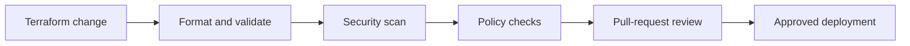

# NorthStar Secure DevSecOps Delivery Pipeline

A secure infrastructure-delivery pipeline for the NorthStar Azure security architecture. This project demonstrates how Terraform changes are validated, scanned, policy-checked, and reviewed before cloud deployment.

## Objective

Reduce delivery risk by applying automated controls to infrastructure-as-code before changes reach Azure.

## Delivery Controls

- Terraform formatting and validation
- Static infrastructure security scanning with Checkov
- Policy-as-code checks for required security controls
- Pull-request quality gates
- Protected deployment workflow design
- Evidence and remediation documentation

## Pipeline Flow

## Relationship to NorthStar

This pipeline governs Terraform delivery practices for the live NorthStar Secure Azure Landing Zone. It is a separate portfolio project focused on secure cloud delivery rather than the landing-zone architecture itself.

## Live Plan Control

- `NorthStar Live Terraform Plan` is a manually triggered GitHub Actions workflow that authenticates through OIDC and generates a Terraform plan against live Azure remote state.
- It uses a dedicated user-assigned managed identity, short-lived tokens, and least-privilege Reader and state-access roles.
- The workflow is plan-only: it contains no `terraform apply` step, and its identity cannot deploy infrastructure.

## Evidence

- [Checkov remediation and exception register](docs/checkov-remediation-register.md)
- [OIDC live Terraform plan control](docs/oidc-live-plan-control.md)
- [Custom least-privilege plan role](deployment/azure-rbac/northstar-terraform-plan-reader.json)
## Scope

NorthStar is portfolio and lab work, not employer production experience.
