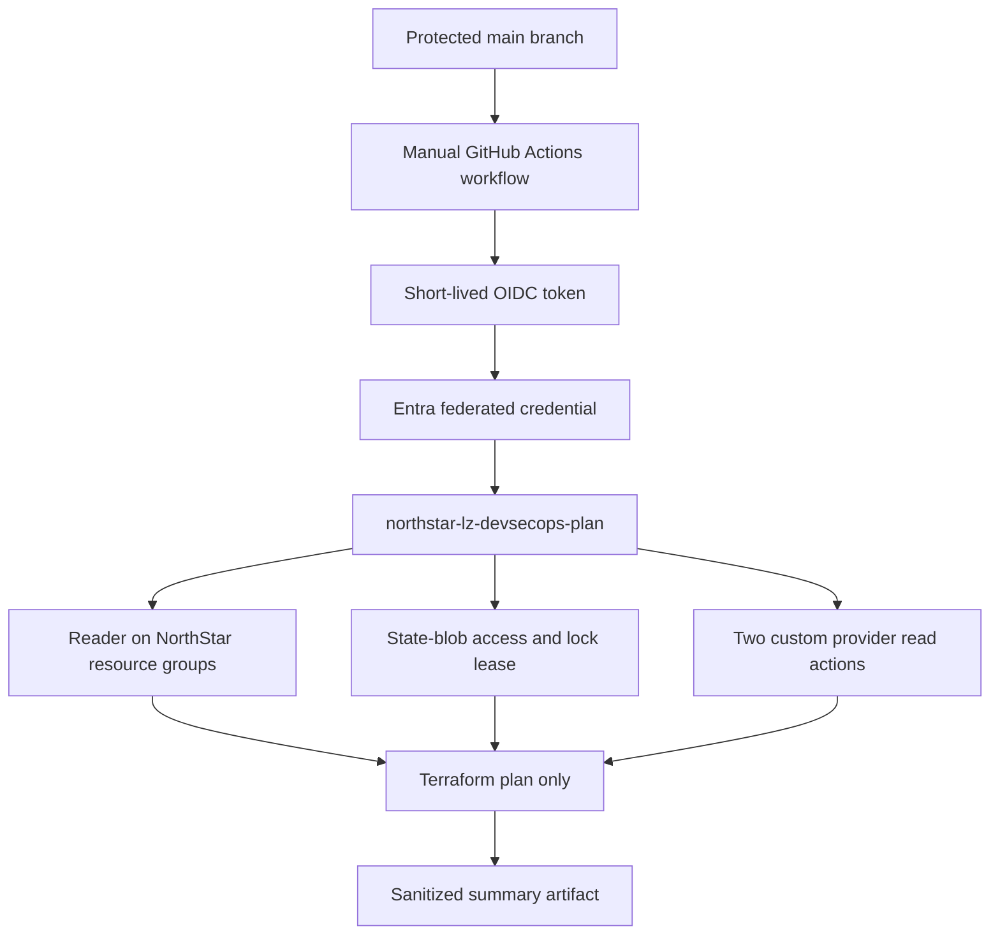

# OIDC Live-Plan Trust Flow

## Security Boundaries

- No Azure client secret is stored in GitHub.
- Federation is restricted to the repository main branch.
- The identity cannot run infrastructure deployments.
- Raw Terraform plan output remains temporary to the runner.
- Only the sanitized plan result is retained as evidence.
